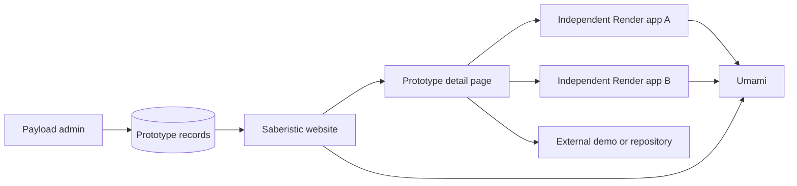

# Information architecture and prototype hub

## Route map

| Route | Purpose | Payload source |
|---|---|---|
| `/` | Positioning, featured prototypes, readiness entry, proof, offers | Homepage global, prototypes, case studies, services |
| `/prototypes` | Searchable/filterable catalog of current and archived experiments | Prototypes |
| `/prototypes/[slug]` | Story, screenshots, status, safety note, build log, links | Prototypes, media, technologies |
| `/readiness` | Complete Production Readiness Check | Versioned code policy plus editable framing copy |
| `/readiness/methodology` | Explain scoring, limitations, privacy, and AI boundary | Pages/global copy plus policy version metadata |
| `/work` | Selected verified experience and case studies | Case studies, experience, evidence sources |
| `/work/[slug]` | Detailed case study with relationship and evidence | Case studies, evidence sources |
| `/services` | The three engagement types and who each is for | Services |
| `/services/[slug]` | Optional post-MVP detail route if one service genuinely needs more depth | Services |
| `/about` | Founder narrative, timeline, capabilities, evidence | Experience, evidence sources, site settings |
| `/contact` | Architecture Diagnostic and direct scoped inquiry | Site settings; private diagnostic/contact request collections |
| `/privacy` | Analytics, AI, forms, retention, and visitor rights | Legal pages |
| `/terms` | Site and prototype usage terms | Legal pages |
| `/admin` | Payload admin; not included in public navigation | Payload |
| `/api/health` | Shallow application health check | Code |
| `/api/ready` | Readiness check including critical dependencies | Code |

Use permanent redirects from current `.html` and legacy routes. Remove or redirect content that conflicts with the new positioning, especially any old “what we do” page that presents a different service taxonomy.

## Homepage composition

### Hero

- one headline and one support paragraph;
- primary CTA: **Check production readiness**;
- secondary CTA: **Explore prototypes**;
- small proof row with truthful labels, not unlabeled client logos.

### Featured prototypes

Show two or three entries. Each card needs:

- name and one-sentence proposition;
- poster image or short muted preview;
- status label and last-updated date;
- capability tags;
- “Try it” and “How it works” actions where applicable.

### Readiness preview

Render the first meaningful choice directly on the homepage. Continuing opens the full flow without losing state. This is a stronger demonstration of AI-enabled product design than a button that launches a generic chat window.

### Proof, services, and about

Keep summaries compact. Each should lead to a page with evidence or deliverables rather than expanding the homepage indefinitely.

## Prototype hub model

The hub is a registry and editorial layer, not the runtime for every app.

This separation preserves freedom of implementation. A prototype can be Next.js, a static app, a small API, a WebGL experiment, or an external tool without forcing the core site to adopt its dependencies or release cycle.

## Prototype status taxonomy

Use exactly one public lifecycle value:

| Status | Meaning | Visitor expectation |
|---|---|---|
| `concept` | A documented idea or design exploration | Not interactive; feedback welcome |
| `prototype` | A narrow working proof of concept | Incomplete, disposable data only |
| `alpha` | Core interaction works; major changes expected | May break; no sensitive data |
| `beta` | Stable enough for broader testing | Known limitations are documented |
| `live` | Maintained and intended for normal use | Published service expectations apply |
| `archived` | No longer maintained | Read-only story or best-effort demo |

Do not use “production” as a casual marketing status. If an app is truly production-ready, document its data handling, support, monitoring, and recovery expectations.

## Prototype record requirements

Every published prototype record must include:

- title, slug, short summary, and long story;
- lifecycle status and `lastVerifiedAt` date;
- problem or hypothesis;
- primary visitor action;
- key decisions or technical lessons;
- featured poster image and optional gallery/video;
- public app URL if interactive;
- source URL if public;
- privacy/data classification;
- known limitations;
- technology tags;
- build log entries or changelog;
- display flags for homepage and prototype index;
- SEO title, description, canonical URL, and social image.

Recommended optional fields:

- `renderServiceId` for internal operations, never shown publicly;
- availability URL for automated checks;
- repository visibility and license;
- related case study, service, or article;
- sort priority and launch date.

The implementation model promotes manual availability and launch-control fields from “optional” to required as risk rises. This is necessary because automated health checking is post-MVP.

## GitHub-backed prototype candidate audit

The company and personal GitHub accounts are discovery inputs, not an automatic portfolio feed. This snapshot was reviewed on **2026-08-28**. Repository ownership, README claims, and configured homepage URLs can create a draft Payload record; only a separate functional and launch-gate review can make that record public or assign `alpha`, `beta`, or `live`.

Two configured demo URLs—BackThen and Story Sprout Pay—returned HTTP `200` during the snapshot. That confirms only that a web server answered. It does not verify the user journey, data handling, payments, accessibility, or operational readiness.

Five organization repositories—`psych-test-forge`, `the-last-press`, `back-then-158e3d21`, `story-sprout-pay`, and `story-weaver-life`—appear to be Lovable exports. Their README prompts and quickly imported histories are design/build artifacts, not completion evidence. Only `growth-program`, `frescopay`, `back-then`, and `orchestra` exposed identifiable licenses in the audit; treat every other repository as `NOASSERTION` until its license file is reviewed. Public metadata showed no external adoption signal, so V2 must not imply usage or traction from stars, forks, or commit counts.

| Candidate | Repository evidence | Honest use in V2 now | Required gate before public featuring |
|---|---|---|---|
| [BackThen](https://github.com/saberistic-team/back-then) | Organization-owned, MIT-licensed, mobile-first life-story foundation; README identifies Milestone 0 and links a Vercel deployment. The companion `back-then-158e3d21` Lovable export is a visual reference, not maturity proof | Strongest human-centered demo candidate; seed as `prototype`, not `live`, with synthetic/sample memories only | Test the complete deployed journey; review authentication, voice/photo storage, export/deletion, consent, privacy copy, accessibility, recovery, and whether to redeploy on Render |
| [FrescoPay](https://github.com/saberistic-team/frescopay) | Organization-owned, MIT-licensed educational USDC→MXN laboratory; README explicitly excludes real money, chains, banks, and compliance vendors | Strongest technical demo candidate; present as a guided, synthetic payment-systems lab | Deploy an isolated Render demo; preserve the no-real-money boundary; add sample reset, health, accessibility, privacy/terms, observability, rollback, and no-credentials tests |
| [TadaDing](https://github.com/saberistic-team/tadading) | Organization-owned visual-puzzle subscription app; repository describes an in-progress Phase 2 and includes multiple runtime components | Third launch candidate if its core puzzle is complete; seed as a draft `alpha` candidate | Establish a public URL, verify web/API/worker/database health, disable or fully validate subscription charging, add disposable accounts/data, and complete mobile/accessibility QA |
| [Story Sprout Pay](https://github.com/saberistic-team/story-sprout-pay) | Organization-owned collaborative storytelling concept with AI, Stripe, user content, royalties, and a Lovable deployment URL | Visually compelling fallback only as a payment-disabled sandbox or recorded walkthrough | Test-mode payments only until webhook idempotency, refunds, royalty rules, moderation, content/IP policy, privacy, abuse controls, and legal review pass |
| [The Last Press](https://github.com/saberistic-team/the-last-press) and [Story Weaver Life](https://github.com/saberistic-team/story-weaver-life) | Organization-owned ambitious realtime/payment/community product specifications | Backlog concepts or build notes, not launch apps | Prove server authority/atomicity, authentication, realtime recovery, payment state, moderation, privacy, availability, and a narrow finished core loop |
| [WorldGraph Anvil](https://github.com/saberistic-team/WorldGraph-Anvil), [Orchestra](https://github.com/saberistic-team/orchestra), and [AgentsRus](https://github.com/saberistic-team/AgentsRus) | Organization-owned AI/agent architecture work; current documentation describes closed-alpha, trusted-machine, local, or high-authority infrastructure boundaries | Technical build notes, diagrams, or recorded private demonstrations | Do not expose privileged agent or Docker control planes publicly; design multi-user identity, isolation, least privilege, abuse limits, secrets handling, and threat model first |
| [Psych Test Forge](https://github.com/saberistic-team/psych-test-forge) | Organization-owned AI psychological-test SaaS concept involving generated/scored assessments and established instruments | **Hold from public launch** | Resolve instrument licensing/IP, clinical and advertising boundaries, validation, sensitive-data privacy, deletion, crisis handling, scoring safety, payments, and qualified legal review |

`agent-web` is the current website implementation source and belongs in migration research, not the prototype catalog. Its large history, missing detected license, and current repository-security settings are reasons to migrate V2 deliberately rather than importing the repository wholesale. Repositories with too little public evidence, such as a title-only README, remain unclassified drafts until a maintainer supplies a product brief and working build.

### Recommended launch sequence

1. **BackThen sample experience** — only after a synthetic-data mode and privacy review make it safe to try.
2. **FrescoPay guided laboratory** — a Render-hosted educational demo that makes systems judgment visible without moving money.
3. **TadaDing public alpha** — if the core puzzle and supporting services pass the launch packet; otherwise use a payment-disabled Story Sprout walkthrough.

This shortlist does not yet satisfy the launch gate. V2 still needs two independently tested public prototypes and one polished featured `beta` or `live` experience. If no candidate honestly meets `beta` or `live`, launch with accurate `prototype`/`alpha` labels and omit the stronger maturity claim rather than upgrading a label for marketing.

## URL and domain strategy

Use these defaults:

- `saberistic.com` — primary website and Payload admin.
- `analytics.saberistic.com` — Umami application and tracker.
- `labs.saberistic.com` — optional alias redirecting to `/prototypes`.
- `name.saberistic.com` — a durable custom domain for a mature prototype.
- Render-generated URL — acceptable for an early or temporary prototype.

Do not create a custom subdomain for every concept. Custom domains consume operational attention and plan allowance. Give one to a prototype when it is public enough to deserve a durable identity.

The prototype record owns its canonical `appUrl`; the website never assumes a URL from the slug.

## Embed policy

Prefer a poster, recorded preview, or small interactive simulation on the detail page, followed by an explicit **Open prototype** action.

If a future prototype needs an iframe, use it only when all of these are true:

- the prototype explicitly permits embedding;
- authentication and payment are not involved;
- cookies, clipboard, camera, microphone, location, and downloads are unnecessary or intentionally allowed;
- the iframe has a restrictive `sandbox` and `allow` policy;
- mobile behavior and keyboard navigation have been tested;
- the visitor can open the full app directly.

Never iframe arbitrary third-party content. An iframe expands the security and accessibility surface and can make ownership unclear.

## Publishing workflow

1. Create the prototype in its own repository and local environment.
2. Deploy it independently, normally as its own Render service or Blueprint. An existing external deployment may be temporary evidence, but the launch packet must name its host and migration decision.
3. Add a health endpoint and verify the live URL.
4. Prepare a poster, accessible alt text, short demo, limitations, and data-safety note.
5. Create a draft Prototype record in Payload.
6. Preview the website detail page in staging.
7. Verify every external link and the `lastVerifiedAt` date.
8. Complete the prototype launch packet: repository/owner, Render service/project, health URL, rollback, data policy, privacy/terms, support expectation, CSP, Umami Website ID, exact allowed hostname, event contract, and no-PII test result.
9. Set the manual availability state/check date and complete status-dependent launch controls.
10. Confirm in staging that Umami receives `prototype_view` and `prototype_launch` without personal data.
11. Publish the record; homepage placement is a separate explicit toggle.
12. Review the record on each meaningful release and at least quarterly while public.

Archiving a prototype should update the record first, preserve the story and screenshots, remove it from featured placement, and then redirect or retire its runtime deliberately.

## Homepage rotation

The homepage should not automatically show the newest entries. Editorial selection is better:

- one polished live or beta product;
- one recent prototype showing current curiosity;
- optionally one technically deep experiment.

Use `featured`, `featuredOrder`, and `featureUntil` fields so stale prototypes do not occupy the homepage indefinitely. Enforce expiry in the homepage query/render path; no background worker is required to make an expired feature disappear.

## Cross-prototype analytics

Create a separate Umami Website record for each durable prototype when it needs its own dashboard. An early prototype may use the main Website record only when its launch packet explicitly lists its hostname in tracker configuration, uses the shared generated event contract, declares the required CSP origins, and passes the same no-PII/referrer/path tests.

Pass only low-cardinality context in events:

- prototype slug;
- status;
- placement such as `home`, `index`, or `detail`;
- action such as `view`, `launch`, `source`, or `feedback`.

Do not pass URLs containing tokens, user-generated strings, email addresses, report text, or internal IDs.

## Resilience and link health

An unavailable prototype must not break server rendering of the main website. Cards and detail pages render from Payload even if the external app is down.

After MVP, add a scheduled link/health checker that:

- requests the configured availability URL;
- records status internally;
- alerts the owner after repeated failures;
- never automatically unpublishes a prototype after a single failure;
- exposes a neutral “temporarily unavailable” label if an outage is confirmed.

## Accessibility and performance gates

Prototype presentation is part of the portfolio's credibility. Before featuring an entry:

- all controls must work by keyboard;
- focus states and headings must be coherent;
- images and video need alternatives;
- reduced-motion preferences must be respected;
- media must be responsive and lazy-loaded below the fold;
- third-party scripts must not block the core page;
- the detail page must remain useful when JavaScript, the prototype, or OpenRouter is unavailable.
