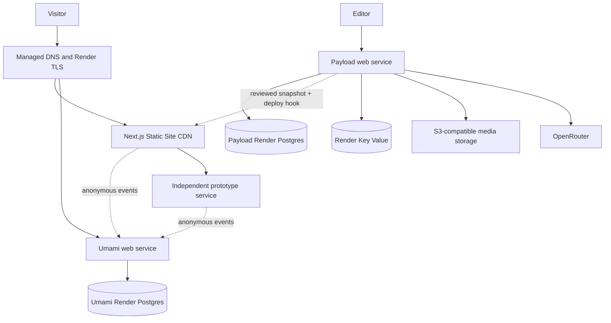

# Render deployment architecture

The accepted public-delivery architecture now separates the Render Static Site from the sleeping
Payload web service. [Document 14](./14-render-static-site-rollout.md) is the implementation and
cutover source of truth; the paid production topology below remains the longer-term durability plan.

## Deployment goal

Run the public site, Payload, Umami, and AI abuse controls as a reproducible Render platform while keeping each independent app prototype isolated from the core website.

The target is not “everything in one container.” It is one coherent Render Project whose services have explicit ownership and failure boundaries.

## Current deployment and production boundary

The repository is live from `saberistic-team/saberistic-v2` through the checked-in `render.yaml`. The current zero-cost staging environment contains two Free web services and one Free PostgreSQL instance: Payload owns `public`, while Umami uses a restricted role and the `umami` schema. The exact live record is in [11](./11-live-staging-deployment.md).

That shared database is a disposable staging exception, not the target topology below. Production still requires service commands, pre-deploy migrations, dedicated Payload and Umami databases, protected networking, backups, retention, health monitoring, and named ownership before resources are created.

## Target production topology



All Render resources in one environment use the same region and internal datastore URLs.

## Render Project organization

Create one core Project named `saberistic-platform`:

```text
saberistic-platform
├─ production — protected, private-network isolation enabled
│  ├─ saberistic-web
│  ├─ saberistic-site
│  ├─ saberistic-payload-db
│  ├─ saberistic-umami
│  ├─ saberistic-umami-db
│  ├─ saberistic-rate-limits
│  ├─ saberistic-payload-backup
│  └─ saberistic-umami-backup
└─ staging — current zero-cost validation environment
   ├─ saberistic-web-staging
   ├─ saberistic-site-staging
   ├─ saberistic-payload-db-staging
   │  ├─ public schema: Payload
   │  └─ umami schema: restricted analytics staging
   ├─ saberistic-umami-staging
   └─ future saberistic-rate-limits-staging
```

Use Render's environment protection and private-network isolation for production. The current Free staging environment has those protections disabled and must not hold durable production data. Repository branch protection remains essential: a Blueprint commit can still change protected resources.

Treat the staging Umami service and its `umami` schema as one disposable upgrade target. The owner has authorized temporary public tracking through `umami.saberistic.com` as an explicit exception, and the analytics service may still be suspended by its Free plan. Never infer that this shared-schema test or temporary collection proves dedicated-database backup, restore, retention, performance, or failure isolation.

Do not place unrelated prototypes in this Project. Give each durable prototype its own Render Project and Blueprint, with its own datastore if needed. A prototype must never connect to the production Payload database or rate-limit store.

## GitHub candidate adoption on Render

The 2026-08-28 GitHub inventory creates a deployment shortlist, not deployable configuration. Each selected repository still needs its own codebase analysis for build/start commands, port binding, health checks, migrations, workers, storage, and secrets before a `render.yaml` is written.

| Candidate                 | Render adoption path                                                                                                                                                            | Boundary                                                                                                                                      |
| ------------------------- | ------------------------------------------------------------------------------------------------------------------------------------------------------------------------------- | --------------------------------------------------------------------------------------------------------------------------------------------- |
| BackThen                  | Prefer a separate Git-backed Blueprint after the end-to-end and privacy review; decide explicitly whether the current Vercel URL is retired, retained as preview, or redirected | Do not copy a local Supabase assumption into production blindly; inventory database, auth, voice/photo storage, and migration ownership first |
| FrescoPay                 | Separate multi-service Blueprint for the smallest guided educational demo that actually needs to run; split public web/API from private worker/orchestration components         | Do not deploy an entire local Docker Compose graph as one public container, and never add real-money or wallet credentials to the demo        |
| TadaDing                  | Separate Blueprint if selected, normally web/API plus a worker and its own datastore where the code audit confirms those components                                             | Subscription charging stays disabled until payment behavior and operational ownership pass the launch packet                                  |
| Story Sprout Pay fallback | Keep the current Lovable endpoint only as a temporary, explicitly external sandbox or redeploy a payment-disabled build to its own Render Project                               | An HTTP-successful external page is not a Render deployment and does not satisfy payment, moderation, or recovery gates                       |

The production core remains a complex multi-service Blueprint target because it requires web/Payload, separate Payload and Umami databases, Umami, Key Value, and backup jobs. The current staging Blueprint deliberately contains only the two web services and one shared-schema database. A genuinely single-service future prototype may use direct Render service creation, but it still needs a Git remote and the same launch packet. Do not create additional live resources until the chosen repository is pushed, the deployment definition is committed, required secrets are identified, and Blueprint validation passes.

## Core resources

### `saberistic-site`

- Type: Render Static Site.
- Application: the `apps/site` Next.js export with `output: 'export'` and real multipage routes.
- Build source: the strict versioned public snapshot from the Payload HTTPS origin.
- Publish path: `apps/site/out`.
- Domain: `saberistic.com`; Render supplies the redirecting `www` counterpart.
- Failure behavior: a failed build does not replace the last successful CDN deployment.
- Secrets: none. Database, Payload, OpenRouter, deploy-hook, and Umami administrator secrets never enter this service.

### `saberistic-web`

- Type: Render web service.
- Runtime: Docker built from this repository.
- Application: Next.js standalone output with Payload embedded.
- Initial instances: one; no persistent disk.
- Database: Payload Postgres internal URL.
- Media: external S3-compatible bucket.
- Rate limit: Key Value internal URL.
- Health path: `/api/ready` after implementing a fast trivial database check.
- Pre-deploy command: run committed Payload migrations once.
- Auto-deploy: only after CI checks pass.

The container must bind HTTP to `0.0.0.0` and the `PORT` Render provides. It should handle `SIGTERM`, stop accepting new work, and complete short in-flight requests within Render's shutdown window.

The final Docker stage must deliberately contain the Payload migration runner, config, migration files, pnpm/runtime tooling, and required packages. A minimal Next standalone image often omits these by default; the Render pre-deploy command must be tested against the built production image.

Render restricts pre-deploy commands to paid web services. The checked-in free staging Blueprint therefore uses a narrow exception: its single-instance container applies idempotent committed migrations in `CMD` and then `exec`s the Next server. This is acceptable for disposable staging only. Before production, move the migration command to `preDeployCommand`, set a paid web plan, and override the Docker command to `node server.js` so schema failure blocks a release before the new server starts.

The Docker build uses Next's database-free compile mode and runtime-rendered CMS routes. Render then runs migrations in pre-deploy before starting the new image. Avoid build-time `NEXT_PUBLIC_*` dependencies by rendering approved public configuration from server environment values. If static content generation is introduced later, migrate before generation and redesign the release sequence explicitly.

### `saberistic-payload-db`

- Type: paid Render Postgres for production.
- Separate credentials and instance from Umami.
- Same region as `saberistic-web`.
- External IP allowlist empty by default.
- Storage autoscaling enabled after reviewing cost/alerts, or monitored with a manual growth plan.
- Paid point-in-time recovery verified.
- Postgres major version pinned at creation because Render does not allow that field to be changed in place.

Use the direct internal connection initially. Render now offers integrated PgBouncer on paid Postgres. Enable it only when measured connection pressure or bursty clients justify it. The managed pool is transaction mode, so clients using `LISTEN/NOTIFY`, temporary tables, session variables, or session advisory locks need direct connections.

### `saberistic-umami`

- Type: image-backed Render web service.
- Image: official Umami GHCR image pinned to a tested version/digest. As reviewed on 2026-08-28, `ghcr.io/umami-software/umami:3.3.1` is a suitable version candidate, not a permanent unreviewed pin.
- Initial instances: one; no persistent disk.
- Health path: `/api/heartbeat`.
- Database: dedicated Umami Postgres internal URL.
- Domain: `analytics.saberistic.com`.

Umami's heartbeat verifies the process but does not query Postgres. Monitor the database separately and use a protected synthetic dashboard/API check if end-to-end readiness is required.

Umami's container startup performs database checks and Prisma migrations unless explicitly disabled. Keep one instance during upgrades, back up first, and stage the new image. Rolling the image back does not automatically reverse its schema migration.

### `saberistic-umami-db`

- Type: paid Render Postgres in production.
- Separate instance from Payload for migration, permission, performance, retention, and recovery isolation.
- Internal connections only by default.
- Start modestly and size from database connections, storage growth, and dashboard latency.

For a strict low-cost prelaunch environment, one Postgres instance can hold two logical databases, but this is a documented temporary compromise: it shares credentials/host resources and couples point-in-time recovery.

### `saberistic-rate-limits`

- Type: Render Key Value (Valkey-compatible).
- Purpose: disposable rate-limit windows, concurrency counters, and challenge state only; no manifests or report cache.
- Internal connection with authentication enabled.
- External IP allowlist empty.
- Eviction: `allkeys-lru`.
- Persistence: off, because rate-limit state is intentionally loss-tolerant.

This resource becomes required before the public OpenRouter endpoint launches, not before the static/CMS site is deployed.

Use the simpler no-client bootstrap for this new prelaunch instance: keep `AI_ENHANCEMENT_ENABLED=0` so no public request depends on Key Value, provision it with `ipAllowList: []`, enable internal authentication in the Render Dashboard, then sync the Blueprint/redeploy so the `fromService.connectionString` refreshes to the credentialed internal URL. Verify authenticated reads/writes and rejection of an unauthenticated URL before setting the feature flag to `1`.

For a future live transition, follow Render's documented migration instead of flipping enforcement: temporarily add the dummy external allowlist entry `0.0.0.0/32`, obtain the external URL, extract its password, construct `redis://default:<password>@<internal-host>:6379`, deploy/test that authenticated internal URL, enable internal authentication, remove the dummy entry, and resync the Blueprint. Never expose the password in Git, logs, or this runbook.

### `saberistic-payload-backup` and `saberistic-umami-backup`

Use two Render Cron Job services before launch, one per database, so each has least-privilege database/object-storage credentials and independent failure evidence.

- Type: `cron`, defined in the core Blueprint.
- Runtime: a small repository-built Docker image containing a matching PostgreSQL client and the approved S3-compatible upload tool.
- Example schedules: staggered daily UTC expressions such as `"15 3 * * *"` and `"45 3 * * *"`; quote them in YAML and choose the final times from the operating window.
- Input: each database's direct internal `connectionString`, never PgBouncer.
- Output: a dedicated encrypted backup bucket or prefixes separated from public media, with versioning/lifecycle and least-privilege write/list permissions.
- Behavior: create a compressed logical export in ephemeral storage, upload it, verify the uploaded object/size or checksum, emit only non-sensitive metadata, and exit nonzero on any failure.
- Monitoring: alert on failure and on a missing/late dated object; do not rely on someone noticing a dashboard event.

Render cron jobs cannot use persistent disks, run at most one invocation of a given job concurrently, use UTC schedules, and are stopped after 12 hours. Database exports should finish far inside that limit. Manually triggering a cron while it is active cancels the active run, so do not use the trigger button casually during a large export.

### Optional `saberistic-jobs`

Add a Render background worker only when Payload background tasks become real: scheduled publishing, prototype availability checks, notifications, or media jobs. Run the Payload jobs runner against the Payload database. Do not add an idle worker merely for architectural symmetry.

## Domain plan

| Domain                     | Destination                                      |
| -------------------------- | ------------------------------------------------ |
| `saberistic.com`           | `saberistic-site`                                |
| `www.saberistic.com`       | Redirect to canonical root                       |
| `analytics.saberistic.com` | `saberistic-umami`                               |
| `labs.saberistic.com`      | Optional redirect to `saberistic.com/prototypes` |
| `[name].saberistic.com`    | Explicit mature prototype service only           |

Payload admin remains at `https://saberistic-web-staging.onrender.com/admin` for the free
architecture. The Static Site redirects `/admin` and `/api/*` to that stable Render origin. A third
`cms` custom domain is unnecessary and would consume another domain allocation.

Render provisions and renews TLS for verified custom domains and redirects HTTP to HTTPS. After verification and DNS cutover, disable the public `onrender.com` subdomain for production services if no operational integration depends on it.

Avoid a wildcard domain for independently deployed prototypes. A Render wildcard routes every matching name to one service, which conflicts with the one-service-per-prototype architecture. Register explicit domains for mature prototypes and let early experiments use Render URLs.

Render's current included custom-domain allowances depend on workspace plan and can change. As reviewed on 2026-08-28, the published allowances are 2 for Hobby, 15 for Pro, and 25 for Scale, with a small per-domain charge beyond that. Recheck before assigning many prototype subdomains.

## Secrets and environment variables

### Website/Payload

| Variable                                           | Source                                                                                          |
| -------------------------------------------------- | ----------------------------------------------------------------------------------------------- |
| `DATABASE_URL`                                     | Blueprint `fromDatabase` internal connection                                                    |
| `PAYLOAD_SECRET`                                   | Render-generated secret                                                                         |
| `SITE_URL`                                         | non-secret server environment value, rendered where public configuration is needed              |
| `OPENROUTER_API_KEY`                               | `sync: false`, entered in Render                                                                |
| `AI_ENHANCEMENT_ENABLED`                           | start at `0`; change to `1` only after OpenRouter and authenticated Key Value launch gates pass |
| `OPENROUTER_PRIMARY_MODEL`                         | reviewed non-secret value                                                                       |
| `OPENROUTER_FALLBACK_MODEL`                        | reviewed non-secret value                                                                       |
| `S3_BUCKET`, `S3_REGION`, `S3_ENDPOINT`            | environment-specific configuration                                                              |
| `S3_ACCESS_KEY_ID`, `S3_SECRET_ACCESS_KEY`         | `sync: false` secrets                                                                           |
| `REDIS_URL`                                        | Blueprint reference to Key Value internal URL                                                   |
| `UMAMI_HOST`                                       | server environment value; render `https://analytics.saberistic.com` into the tracker tag        |
| `UMAMI_WEBSITE_ID`                                 | environment-specific public ID rendered by the server layout                                    |
| `SMTP_HOST`, `SMTP_PORT`, `SMTP_USER`, `SMTP_PASS` | approved mail provider; credentials use `sync: false`                                           |
| `EMAIL_FROM_NAME`, `EMAIL_FROM_ADDRESS`            | verified non-secret sender identity                                                             |

### Umami

| Variable                    | Source                                                                                                                                                        |
| --------------------------- | ------------------------------------------------------------------------------------------------------------------------------------------------------------- |
| `DATABASE_URL`              | Blueprint `fromDatabase` internal connection                                                                                                                  |
| `APP_SECRET`                | Render-generated stable secret                                                                                                                                |
| `TWO_FACTOR_ENCRYPTION_KEY` | derived inside the staging wrapper from a Render-generated seed; use an independently managed stable 64-character hex value for the target production service |
| `DISABLE_TELEMETRY`         | `1`                                                                                                                                                           |
| `PRIVATE_MODE`              | `1` after verifying required behavior                                                                                                                         |
| `DISABLE_UPDATES`           | `1` when upgrades are handled operationally                                                                                                                   |
| `SALT_ROTATION`             | explicit `month` default unless a documented measurement/privacy decision changes it                                                                          |

Render's `generateValue` creates a strong base64 secret, but Umami's 2FA key requires a 64-character hexadecimal value. The implemented staging wrapper derives that value from a generated seed without exposing the seed to the Umami child; the target production service should retain an equally stable, recoverable key procedure.

Blueprint placeholders marked `sync: false` are prompted only on initial creation and are not copied into preview environments. Maintain a secret inventory and provision preview/staging values deliberately.

## Illustrative Blueprint shape

This is an architecture outline, not the final `render.yaml`. Service plans, repository details, image digest, commands, and all staging resources must be validated after the app exists.

```yaml
previews:
  generation: manual
  expireAfterDays: 3

projects:
  - name: saberistic-platform
    environments:
      - name: production
        networking:
          isolation: enabled
        permissions:
          protection: enabled
        services:
          - type: web
            name: saberistic-web
            runtime: docker
            region: virginia
            plan: 0.5c-512mb
            numInstances: 1
            autoDeployTrigger: checksPass
            dockerfilePath: ./Dockerfile
            dockerContext: .
            healthCheckPath: /api/ready
            preDeployCommand: pnpm payload migrate
            envVars:
              - key: DATABASE_URL
                fromDatabase:
                  name: saberistic-payload-db
                  property: connectionString
              - key: REDIS_URL
                fromService:
                  type: keyvalue
                  name: saberistic-rate-limits
                  property: connectionString
              - key: PAYLOAD_SECRET
                generateValue: true
              - key: OPENROUTER_API_KEY
                sync: false
              - key: AI_ENHANCEMENT_ENABLED
                value: '0'
              - key: SMTP_PASS
                sync: false
              - key: S3_ACCESS_KEY_ID
                sync: false
              - key: S3_SECRET_ACCESS_KEY
                sync: false

          - type: web
            name: saberistic-umami
            runtime: image
            region: virginia
            plan: 0.5c-512mb
            numInstances: 1
            image:
              url: ghcr.io/umami-software/umami:3.3.1
            healthCheckPath: /api/heartbeat
            envVars:
              - key: DATABASE_URL
                fromDatabase:
                  name: saberistic-umami-db
                  property: connectionString
              - key: APP_SECRET
                generateValue: true
              - key: TWO_FACTOR_ENCRYPTION_KEY
                sync: false
              - key: DISABLE_TELEMETRY
                value: '1'
              - key: PRIVATE_MODE
                value: '1'
              - key: DISABLE_UPDATES
                value: '1'
              - key: SALT_ROTATION
                value: month
              - key: PORT
                value: '3000'

          - type: keyvalue
            name: saberistic-rate-limits
            region: virginia
            plan: 256mb
            ipAllowList: []
            maxmemoryPolicy: allkeys-lru
            persistenceMode: off

          - type: cron
            name: saberistic-payload-backup
            runtime: docker
            region: virginia
            plan: 0.5c-512mb
            schedule: '15 3 * * *'
            dockerfilePath: ./ops/postgres-backup/Dockerfile
            dockerContext: .
            envVars:
              - key: DATABASE_URL
                fromDatabase:
                  name: saberistic-payload-db
                  property: connectionString
              - key: BACKUP_BUCKET
                sync: false
              - key: BACKUP_PREFIX
                value: payload
              - key: S3_ACCESS_KEY_ID
                sync: false
              - key: S3_SECRET_ACCESS_KEY
                sync: false
              - key: POSTGRES_VERSION
                value: '17'

          - type: cron
            name: saberistic-umami-backup
            runtime: docker
            region: virginia
            plan: 0.5c-512mb
            schedule: '45 3 * * *'
            dockerfilePath: ./ops/postgres-backup/Dockerfile
            dockerContext: .
            envVars:
              - key: DATABASE_URL
                fromDatabase:
                  name: saberistic-umami-db
                  property: connectionString
              - key: BACKUP_BUCKET
                sync: false
              - key: BACKUP_PREFIX
                value: umami
              - key: S3_ACCESS_KEY_ID
                sync: false
              - key: S3_SECRET_ACCESS_KEY
                sync: false
              - key: POSTGRES_VERSION
                value: '17'

        databases:
          - name: saberistic-payload-db
            region: virginia
            plan: 0.5c-1g
            postgresMajorVersion: '17'
            databaseName: saberistic
            user: saberistic
            ipAllowList: []
            connectionPool: none

          - name: saberistic-umami-db
            region: virginia
            plan: 0.5c-1g
            postgresMajorVersion: '17'
            databaseName: umami
            user: umami
            ipAllowList: []
            connectionPool: none
```

Before committing the real file:

- choose the region based on visitors, existing account resources, and object-storage placement;
- confirm every plan ID and current price;
- add all non-secret environment values;
- verify the Key Value URL uses the supported Blueprint service reference shown above, then complete Render's authenticated-internal-access transition before the public AI endpoint launches;
- promote `AI_ENHANCEMENT_ENABLED` to `1` in the environment's reviewed Blueprint only after the authenticated Key Value and OpenRouter fallback tests pass;
- implement and test `./ops/postgres-backup/Dockerfile` and its non-logging backup entrypoint before retaining the illustrative cron definitions;
- duplicate the environment with unique staging resource names and smaller appropriate plans;
- add custom domains after staging works;
- validate with Render CLI 2.7 or newer and the current Blueprint schema;
- confirm that the pre-deploy migration command is present in the built image and connects directly to Postgres.
- confirm the Docker build does not query the production schema and CMS routes render correctly after pre-deploy migration.
- verify both Postgres instances use UTC and the Umami container listens on the configured port.

## Health endpoints

### `/api/health`

Fast liveness response with build version and no dependency calls. It must reveal no secret or environment detail.

### `/api/ready`

Render health path for the web service. Perform a bounded trivial Postgres query and return a generic status. Do not call OpenRouter, object storage, Umami, or prototypes; those are degradable dependencies and would create unnecessary restart loops.

Umami uses `/api/heartbeat`, with a separate database monitor because the endpoint is process-only.

## Deployment sequence

1. Build and test the application locally with local Postgres and object-storage-compatible development settings.
2. Initialize Git, add CI, and push the repository to a supported provider.
3. Create the early staging thin slice through a validated Blueprint: web, Payload Postgres, and object storage only.
4. Populate all `sync: false` secrets in the Dashboard.
5. Run the initial Payload migration and seed only non-sensitive staging data.
6. Verify the thin slice end to end: health, admin, publish, public read, upload persistence, restart, and rollback.
7. Add the staging Umami service/database pair, OpenRouter configuration, and Key Value when their workstreams are ready.
8. Keep AI enhancement disabled, enable Key Value internal authentication before any live client depends on it, resync/redeploy to refresh the Blueprint connection reference, and verify authenticated success plus unauthenticated rejection. Use Render's dummy-allowlist/password migration only if converting an instance that already has live clients.
9. Verify Umami events, AI fallback, compliant OpenRouter routing, and Key Value-backed limits in staging.
10. Create paid production databases and verify recovery settings before importing content.
11. Start automated daily logical exports for both databases, alert on failure, and complete a restore drill.
12. Deploy production with temporary Render URLs.
13. Import verified content and create the first admin account through a controlled process.
14. Add and verify custom domains and TLS.
15. Lower DNS TTL, cut over, validate redirects and analytics, then restore a normal TTL.
16. Disable unused default subdomains and external datastore access.
17. Run the post-launch checks in [09](./09-operations-security-and-runbook.md).

All production schema changes use expand/contract compatibility. A successful pre-deploy migration is not rolled back if the new image later fails its health check; the previously active image can continue running against the new schema.

## Scaling rules

- Start each stateless web service at one instance and measure CPU, memory, response latency, connection count, and queueing.
- Add a second web instance only after session state, uploads, caches, migrations, and rate limits are confirmed external/shared.
- Do not attach a persistent disk; Render services with a disk cannot scale horizontally and lose normal zero-downtime deploy behavior.
- Enable Render's integrated Postgres connection pool only when metrics justify it and clients are compatible.
- Autoscaling requires an eligible workspace plan; manual scaling remains sufficient for the initial launch.
- Preview environments are useful for risky infrastructure changes but require an eligible plan, incur normal resource cost, and start with empty datastores rather than copies of production.

## Backups

Paid Render Postgres provides continuous point-in-time recovery. The current published window is three days for Hobby workspaces and seven days for Pro or higher. Render dashboard logical exports are retained for seven days; download or copy exports to independent storage for longer retention.

For both databases:

- verify PITR is active;
- create automated daily logical exports to independent encrypted object storage before launch;
- assign a named owner and backup owner, alert on export failure, and retain dated evidence of the last successful job;
- use direct Postgres URLs for backup jobs, never PgBouncer;
- test restoring into an empty temporary database;
- protect object-storage media with versioning/lifecycle appropriate to the provider;
- document ownership and results in the operations runbook.

## Cost posture

Do not hardcode a monthly total in architecture docs; Render and model prices change. Estimate from the live pricing pages immediately before provisioning.

Minimum production resources are two web services, two paid Postgres instances, two short-running daily backup cron services, and a small Key Value instance when AI launches, plus object storage and OpenRouter usage. The staging Umami service/database pair can be suspended or kept at the smallest tested size when not under test; do not replace it with production access, a shared production database, or ephemeral media.

## Render acceptance criteria

- staging and production are in isolated environments and every resource uses one region;
- only internal datastore URLs are used by Render services;
- production Postgres and Key Value external allowlists are empty unless an exception is documented;
- both web services deploy without a persistent disk;
- a failed Payload migration blocks the new image, and every successful migration remains backward-compatible with the previously active image;
- a failed OpenRouter or Umami call does not make the website unhealthy;
- a Payload database outage makes `/api/ready` fail and the MVP public CMS routes may be unavailable; Render's generic maintenance/error path is the deliberate initial behavior, not an untested stale-content promise;
- TLS, canonical redirects, health checks, secrets, backups, and restore procedure are verified;
- each unrelated prototype has an independent service/project and cannot access the core production datastores;
- the final `render.yaml` passes current Render Blueprint validation.

## Official references

- [Render Blueprints](https://render.com/docs/infrastructure-as-code)
- [Blueprint YAML reference](https://render.com/docs/blueprint-spec)
- [Projects and environments](https://render.com/docs/projects)
- [Web services and port binding](https://render.com/docs/web-services)
- [Health checks](https://render.com/docs/health-checks)
- [Custom domains](https://render.com/docs/custom-domains)
- [Persistent-disk constraints](https://render.com/docs/disks)
- [Render Postgres connections](https://render.com/docs/postgresql-creating-connecting)
- [Postgres recovery and backups](https://render.com/docs/postgresql-backups)
- [Integrated Postgres connection pooling](https://render.com/docs/postgresql-connection-pooling)
- [Render Key Value](https://render.com/docs/key-value)
- [Render Cron Jobs](https://render.com/docs/cronjobs)
- [Render Postgres-to-S3 backup guide](https://render.com/docs/backup-postgresql-to-s3)
- [Environment variables and secrets](https://render.com/docs/configure-environment-variables)
- [Preview environments](https://render.com/docs/preview-environments)
