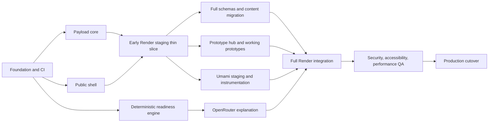

# Implementation plan

## Planning assumptions

- One primary builder owns design and implementation, with occasional content/security review.
- The application starts from documentation rather than an existing V2 codebase.
- Payload, Umami, OpenRouter, Render, and the hub-and-spoke prototype approach are accepted.
- Existing live-site URLs need an explicit redirect/content migration inventory.
- Initial launch includes at least three complete prototype records, at least two functioning public prototypes, and one polished featured `beta` or `live` experience.
- Claims marked on hold in [03](./03-verified-content-and-ai-brief.md) remain unpublished.

A focused solo implementation is reasonably a six-to-eight-week effort, depending on design polish, content approval, and how complete the first prototypes are. This is a planning range, not a delivery commitment.

## Dependency map

## Workstream 0 — decisions and inventory

### Tasks

- Confirm the booking/payment destination and fulfillment owner for the accepted **Architecture Diagnostic — $200**.
- Audit the supplied `saberistic-team` and `saberistic` GitHub accounts; classify organization-owned, personal-original, fork, and external-contribution evidence separately.
- Run go/no-go reviews for BackThen, FrescoPay, and TadaDing, with payment-disabled Story Sprout Pay as a fallback; assign statuses, URLs, screenshots, licenses, limitations, and data-safety notes only from verified evidence.
- Choose Render region and workspace plan.
- Choose AWS S3 or Cloudflare R2 for Payload media.
- Decide booking/contact destination and notification method.
- Approve the evidence wording and claim holds in [03](./03-verified-content-and-ai-brief.md).
- Crawl/export every current `saberistic.com` route and prepare a keep/rewrite/redirect/remove map.
- Decide analytics retention and the public privacy wording.
- Confirm access to domain DNS, Render, OpenRouter, object storage, and Git provider.

### Exit criteria

- no unresolved decision changes the application topology or public offer;
- the initial content/prototype inventory has an owner, source relationship, license state, evidence state, and honest lifecycle status;
- every production account can use MFA and has a recovery owner.

## Workstream 1 — repository and application foundation

### Tasks

- Scaffold the official Payload website template with a compatible pinned Next.js version.
- Configure TypeScript strict mode, linting, formatting, unit tests, end-to-end tests, and lockfile policy.
- Add local Postgres development configuration and sample environment file without secrets.
- Add Next standalone output and a multi-stage Dockerfile.
- Configure Next's database-free compile strategy and server-rendered public runtime configuration; prove the image build does not query Payload content.
- Implement `/api/health` and `/api/ready`.
- Add CI for typecheck, lint, unit tests, production build, migration status, and Blueprint validation when the file exists.
- Initialize Git and connect the supported remote repository.
- Establish branch protection and required CI checks.
- Enable secret scanning/push protection and dependency-security updates where the Git provider plan supports them; otherwise add equivalent CI scanning and a documented dependency-review cadence. Do not inherit the weaker settings observed on legacy organization repositories.

### Exit criteria

- clean checkout can install, start, test, and build from documented commands;
- Docker image runs locally and binds the configured port;
- no secret or production identifier is committed;
- CI blocks a broken build.

## Workstream 2 — Payload core for the thin slice

### Tasks

- Implement users and role-based access.
- Implement the core prototype and media collections plus the minimum site-settings, navigation, and homepage globals needed for the public shell.
- Add prototype drafts/versions, secure preview, published-only collection access, and private operational fields.
- Configure S3-compatible storage and responsive media sizes.
- Install/configure `sharp` and an official Payload email adapter; test password recovery through the chosen mail provider.
- Create the first Postgres migration and an idempotent development/staging seed containing one draft/published prototype fixture.
- Generate Payload types and test the narrow public prototype projection.

### Exit criteria

- an editor can publish the seeded prototype without code changes;
- users and private prototype/media fields are absent from public APIs;
- uploaded media persists outside the application filesystem;
- migration and seed succeed twice without corrupting data;
- anonymous Local API reads respect access control and cannot return first drafts or private fields;
- password reset works end to end.

## Workstream 2A — early Render staging thin slice

This is the first hosted milestone, not the final platform integration. It deliberately excludes Umami, OpenRouter, and Key Value so infrastructure risk is exposed before those features depend on it.

### Tasks

- Create the initial staging Render Project/environment with the web service and a staging Payload Postgres database.
- Configure environment-specific object storage, least-privilege credentials, health checks, and the first committed migration. Free staging may run it at single-instance container startup; paid environments use Render pre-deploy.
- Deploy the smallest useful public route set: homepage shell, prototype index, one seeded prototype detail, and working media.
- Prove the production image builds without a database connection and the runtime reads published content after migrations complete.
- Record the service, database, bucket/prefix, owner, URL, health endpoint, and rollback path.

### Exit criteria

- a CMS edit to the seeded prototype can be published and seen on the staging public page;
- a media upload survives a service restart/redeploy;
- `/api/ready` proves the Payload database is reachable without testing degradable integrations;
- a failed migration blocks the new release and the previous compatible image remains recoverable;
- the thin slice proves CMS → Postgres → media → Render → public page before readiness AI work begins.

## Workstream 2B — complete Payload content platform

Start this only after Workstream 2A is green; it is the “full schemas and content migration” node in the dependency map.

### Tasks

- Implement case studies, experience, evidence sources, services, pages, technologies, diagnostic requests, and direct contact requests.
- Complete site settings, navigation, homepage, and readiness-copy globals.
- Implement the Git-owned public-action registry and restrict Payload conversion fields to its allowed IDs.
- Add drafts, versions, secure preview, SEO groups, and field-level access for every editorial type.
- Add the canonical relationship labels, per-claim evidence/permission states, derived page status, and publication hooks that block held claims.
- Add public API projections and private-request access tests.
- Extend committed migrations and the idempotent seed with approved evidence/content fixtures.

### Exit criteria

- an editor can publish a case study, experience item, service, page, and prototype without code changes;
- unsupported or permission-restricted material claims cannot publish accidentally;
- rich-text proof pages render material role/contribution/outcome/metric statements only through structured approved claim records/blocks;
- diagnostic and contact requests are private and cannot enter public projections;
- all collection/global types, migrations, access tests, and seed fixtures pass CI.

## Workstream 3 — design system and public routes

### Tasks

- Establish typography, color, spacing, surfaces, status badges, buttons, forms, motion, and responsive breakpoints.
- Build the global header/footer, skip links, error states, loading states, and metadata utilities.
- Build homepage blocks in the order defined in [01](./01-product-and-site-strategy.md).
- Build Prototypes index/detail, Work index/detail, Services index, About, Contact, Privacy, Terms, and AI Methodology routes. Treat separate service-detail routes as post-MVP unless approved content proves they are needed.
- Add sitemap, robots configuration, canonicals, Open Graph images, and organization/person/service structured data where truthful.
- Implement legacy URL redirects.
- Add secure response headers and a Content Security Policy compatible with Umami and required media.

### Exit criteria

- each route renders useful content without client JavaScript where practical;
- keyboard, focus, headings, contrast, reduced motion, and media alternatives pass review;
- no page uses unsupported logos or ambiguous client relationships;
- current indexed URLs resolve or redirect intentionally.

## Workstream 4 — prototype hub

### Tasks

- Implement featured selection, cards, detail presentation, and minimal status grouping; defer rich filtering until the catalog has more than six entries.
- Implement safe external launch and source-link components.
- Implement preview media. Defer the iframe component until a selected prototype actually requires and passes the documented embed policy.
- Add stale/archived/unavailable display states.
- Seed audited GitHub candidates as **draft** records with repository provenance. Never infer publication, availability, or lifecycle status from GitHub visibility, recent commits, README copy, or a repository homepage field.
- Deliver the prototype runtime critical path, even when it lives in another repository: named owner, source repository, Render project/service, health endpoint, accessibility review, data classification/privacy/terms, CSP, Umami Website ID/allowed hostname/event contract, monitoring, rollback, and content assets.
- Publish three complete records. The target launch has at least two functioning public prototypes and one polished featured `beta` or `live` experience; if fewer are ready, do not pretend that static cards form a mature hub.
- Add a reusable lightweight template/readme for future prototype repos covering health, privacy, analytics, and Render deployment.

### Exit criteria

- prototype failure cannot break the main site;
- each featured item has status, last verification, limitations, and data-safety guidance;
- each source link carries the correct organization-owned, personal-original, fork, or external-contribution relationship, and no draft becomes public through repository sync alone;
- status/data-sensitivity publication gates and manual availability fields are enforced;
- publishing or rotating a featured prototype is a CMS action;
- `featureUntil` is enforced at query/render time;
- each interactive prototype has a completed launch packet, tested rollback, and independent failure boundary;
- live-app and source links are keyboard accessible and tracked without personal data.

## Workstream 5 — deterministic readiness engine

### Tasks

- Finalize question IDs, controlled options, control IDs, dimension weights, level bands, and hard blockers.
- Implement schema validation and sensitive-input checks.
- Implement score, completeness, blockers, unknowns, strengths, plans, CTA mapping, and deterministic fallback report.
- Build the five-section wizard, example profiles, progress, result scorecard, print/download view, and explicit handoff.
- Create the golden fixtures and unit tests described in [06](./06-openrouter-readiness-check-implementation.md).
- Write methodology, limitation, and privacy copy matching actual behavior.

### Exit criteria

- every manifest produces a complete result without AI;
- every blocker and score threshold is covered by tests;
- no file, repository, URL, code, log, or unbounded text input exists;
- a model can never affect the score, level, blocker set, or CTA.

## Workstream 6 — OpenRouter enhancement

### Tasks

- Choose a primary and fallback model from currently supported structured-output/ZDR endpoints.
- Create a dedicated limited API key and Guardrail with model/provider allowlists, spend cap, ZDR, data-collection denial, sensitive-info handling, and injection handling.
- Implement strict JSON Schema request/response handling.
- Enforce server-side invariants and deterministic fallback.
- Add Key Value-backed rate limits, concurrency cap, timeouts, one fallback attempt, and safe operational logs.
- Run the golden evaluation set against both models and record the approved versions.
- Exercise budget exhaustion, provider unavailability, invalid JSON, privacy-routing failure, and guardrail block paths.

### Exit criteria

- live account configuration and code both enforce privacy/routing constraints;
- a compliant provider outage returns the deterministic report, never a looser privacy route;
- cost cannot exceed the configured key/guardrail budget;
- logs, Payload, and Umami contain no answer or report content.

## Workstream 7 — Umami

### Tasks

- Provision the pinned Umami service for validation. The implemented zero-cost staging exception shares Payload's Free PostgreSQL instance through a restricted role and `umami` schema; production still requires a dedicated analytics database. Keep the website tracker disabled throughout this disposable staging phase.
- Set stable secrets, 2FA key, privacy flags, domain filtering, and query/hash exclusion.
- Change default credentials and enable 2FA.
- Add the typed event wrapper and exact taxonomy in [05](./05-umami-analytics-implementation.md).
- Keep `identify()` and session replay disabled.
- Verify SPA navigation, funnel events, ad/tracker failure behavior, and no PII leakage.
- Document retention, upgrade, backup, and dashboard access.

### Exit criteria

- production domain traffic is separated from staging/internal traffic;
- the staging service and schema are validated together as a disposable pre-production target, while dedicated-database backup, restore, retention, and failure isolation remain separate production gates;
- events have only allowed low-cardinality metadata;
- tracker failure is invisible to core UX;
- a database export and staged upgrade have been tested.

## Workstream 8 — full Render integration and production platform

### Tasks

- Write the production-grade Dockerfile and final `render.yaml` from [07](./07-render-deployment-architecture.md).
- Define staging and production Project environments with network isolation and protection.
- Provision separate Payload/Umami databases and the Key Value instance.
- Populate secrets and use internal datastore URLs.
- Configure Payload pre-deploy migrations and health checks.
- Configure object storage CORS, environment prefixes/buckets, and least-privilege credentials.
- Implement two least-privilege Render Cron Job services—one per Postgres database—for staggered daily UTC logical exports to independent encrypted object storage, with failure/late-object alerts and named owners.
- Keep AI enhancement disabled while enabling Key Value internal authentication on the new prelaunch instance; resync/redeploy the Blueprint connection reference, then verify authenticated success and unauthenticated rejection before enabling public AI.
- Validate Blueprint structure with current Render CLI.
- Deploy staging and exercise a full content, upload, analytics, AI, and form workflow.

### Exit criteria

- one Blueprint owns each core resource;
- a failed migration prevents the new image from starting, and expand/contract schema changes keep the previous image compatible if the new health check fails after migration;
- staging cannot connect to production private resources;
- both backup cron jobs can be manually triggered, produce verified dated objects without logging secrets, alert on a forced failure, and restore successfully into empty temporary databases;
- services restart/redeploy without losing content, analytics, media, or rate-limit correctness.

## Workstream 9 — content migration and proof review

### Tasks

- Import approved homepage, About, service, experience, case-study, evidence, and legal content.
- Use the resume as a source for Saber's experience, then publish only the wording and attribution permitted by the evidence rules.
- Import the two supplied GitHub inventories as evidence/prototype drafts; preserve repository relation, license, snapshot date, and review state rather than mirroring README marketing copy.
- For external projects and forked repositories, link specific authored commits, pull requests, or maintainer evidence before describing Saber's contribution.
- Add direct evidence links beside supported claims.
- Store only the canonical relationship enums `employment`, `contract`, `founder`, `team_role`, `saberistic_engagement`, `sanitized_diagnostic`, `independent`, `open_source`, and `research`; render their exact public labels from [03](./03-verified-content-and-ai-brief.md).
- Run a link check and manually inspect archived evidence.
- Review every image/logo for rights and accurate implication.
- Confirm all held metrics/outcomes remain absent.

### Exit criteria

- every material proof claim has an evidence state and relationship label;
- no placeholder, fabricated metric, or unauthorized logo remains;
- a reader can distinguish personal experience from Saberistic client work.

## Workstream 10 — launch QA and cutover

### Functional QA

- CMS login, role boundaries, preview, publish/unpublish, media, migrations, form, readiness fallback, AI result, rate limits, Umami events, and redirects.

### Quality QA

- mobile/desktop/browser coverage;
- accessibility automation plus keyboard/screen-reader smoke test;
- performance and Core Web Vitals under realistic media;
- SEO crawl, metadata, canonicals, sitemap, social cards, and structured data;
- security headers, CSP, cookie behavior, dependency scan, secret scan, and abuse tests;
- backup creation and restore drill.

### Cutover

- deploy production on temporary domains;
- import approved content;
- verify custom domains and TLS;
- cut DNS, validate root/`www` redirects and all critical paths;
- run a real readiness assessment and diagnostic submission;
- verify Umami events contain allowed properties only;
- monitor logs, errors, spend, and database metrics closely for 48 hours.

### Exit criteria

All launch gates below are green and a rollback owner is available during cutover.

## Launch gates

| Gate | Required evidence |
|---|---|
| Trust | Claim/evidence audit completed; hold list absent from public output |
| CMS | Role/access tests, migration test, and external media persistence |
| Prototypes | Three complete records; two functioning public prototypes; one polished featured `beta` or `live` experience; launch packet and failure isolation for each interactive app |
| AI | Deterministic coverage, model eval, privacy routing, budget cap, fallback test |
| Analytics | No-PII review, event/funnel test, admin hardening, retention decision |
| Render | Blueprint validation, isolated envs, health checks, internal DB URLs |
| Recovery | Automated daily exports active and monitored; database and media recovery procedure tested |
| Security | CSP/headers/secrets/rate limits/forms reviewed |
| Accessibility | Keyboard, focus, semantics, contrast, motion, media alternatives reviewed |
| Performance | Agreed page-weight and Core Web Vitals budgets met on representative devices |
| Operations | Alerts, owners, runbook, vendor recovery access, and rollback ready |

## Suggested six-to-eight-week sequence

| Period | Focus |
|---|---|
| Week 1 | Decisions, live-route and GitHub inventory, prototype go/no-go reviews, Payload/Next scaffold, local DB, CI |
| Week 2 | Payload core, object storage, public shell, and early Render staging thin slice |
| Week 3 | Homepage, Work, Services, About, Contact, initial content |
| Week 4 | Prototype hub, initial prototypes, redirects, SEO, accessibility pass |
| Week 5 | Deterministic readiness engine, wizard, fallback, golden tests |
| Week 6 | OpenRouter, Key Value limits, Umami, privacy/security tests |
| Week 7 | Full Render integration/production, automated backups, content proof review, performance and restore drill |
| Week 8 buffer | Design polish, model evaluation fixes, DNS cutover, 48-hour observation |

Parallelize content/evidence review and prototype preparation from the first week; they should not wait for the CMS UI.

## Immediate next ten tasks

1. Complete functional and safety go/no-go reviews for BackThen, FrescoPay, and TadaDing; keep payment-disabled Story Sprout Pay as the fallback and do not assign `beta`/`live` from repository evidence alone.
2. Confirm the Architecture Diagnostic booking/payment destination and fulfillment workflow.
3. Select Render region and object-storage provider.
4. Export the live route inventory and redirect map.
5. Scaffold the pinned Payload/Next project.
6. Add local Postgres, Docker, health routes, and CI.
7. Implement `users`, `media`, `evidence-sources`, and `prototypes` first, including repository provenance and source-review fields.
8. Create the initial migration and seed audited GitHub candidates as unpublished drafts.
9. Build the homepage shell and prototype index from seeded content.
10. Deploy that thin vertical slice to Render staging before building the AI feature.

The thin vertical slice is deliberate: it proves CMS → database → media → build → Render → public page early, before the more complex readiness work depends on the platform.

## Post-launch backlog

- automated prototype availability checks and a Payload jobs worker;
- scheduled publishing after worker verification;
- public build notes/articles if there is a sustainable writing cadence;
- richer prototype filters only after enough entries exist;
- preview environments for high-risk pull requests;
- second web instance/autoscaling when metrics justify it;
- saved readiness reports only after explicit account/privacy design;
- repository/code analysis only as a separate, authenticated, high-security product.
